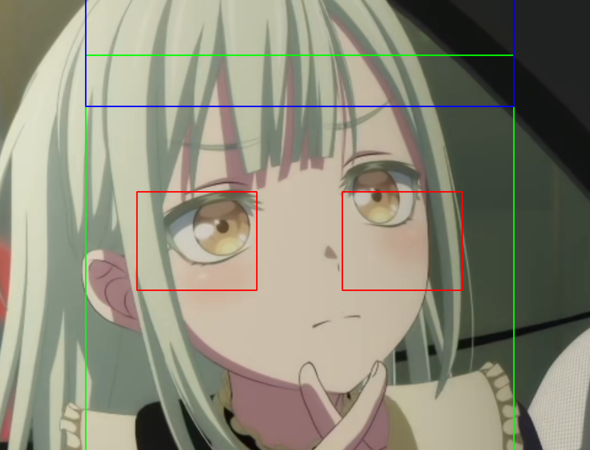

# 动漫角色发色瞳色与角色特点关联分析

本项目围绕“动漫角色发色、瞳色与角色特点之间是否存在关联”展开，结合数据清洗、探索性分析、K-Means 聚类、Apriori 关联规则和 OpenCV 图像识别，完成一个可上传图片并输出发色、瞳色、相似角色推荐的 Web 原型。(仅作为课程展示用途，代码尚不完善)

## 项目内容

- 原版汇报 PPT：`docs/original_ppt/动漫角色发色瞳色分析.pptx`
- 个人案例总结：`docs/个人案例总结.md`
- 尚不完善的代码结果：
  - `src/app.py`：Flask 图片识别与推荐系统
  - `src/analysis.py`：角色数据聚类、关联规则分析与图表导出
  - `src/img1.py`：单张图片发色、瞳色识别演示脚本，可输出带检测框的结果图
  - `src/crawlers/py.py`：萌娘百科角色信息采集脚本，按页面标签提取发色、瞳色和萌点
  - `src/crawlers/py2.py`：萌娘百科角色信息采集脚本，按信息表 `tr/td` 结构提取字段
  - `templates/index.html`：Web 页面模板
  - `data/characters_sample.csv`：示例角色数据

## 目录结构

```text
anime-character-color-analysis/
├── data/
│   └── characters_sample.csv
├── docs/
│   ├── original_ppt/
│   │   └── 动漫角色发色瞳色分析.pptx
│   ├── 个人案例总结.md
│   └── 小组案例报告_动漫角色发色瞳色关联分析.pdf
├── models/
│   └── README.md
├── runtime/
│   ├── debug/
│   └── uploads/
├── src/
│   ├── crawlers/
│   │   ├── py.py
│   │   └── py2.py
│   ├── analysis.py
│   ├── app.py
│   └── img1.py
├── templates/
│   └── index.html
├── .gitignore
├── README.md
└── requirements.txt
```

## 环境安装

建议使用 Python 3.10 及以上版本。

```bash
python -m venv .venv
.venv\Scripts\activate
pip install -r requirements.txt
python -m playwright install chromium
```

## 运行 Web 系统

```bash
python src/app.py
```

浏览器打开：

```text
http://127.0.0.1:5000
```

上传动漫角色图片后，系统会：

1. 估算或检测角色脸部区域；
2. 提取头发区域和眼睛区域；
3. 使用 HSV 颜色空间和 K-Means 提取主色；
4. 将 RGB/HSV 结果映射为发色、瞳色标签；
5. 根据角色数据库推荐相似角色并统计共同萌点。

## 图片识别效果展示

原图：


识别结果：



也可以使用单张图片演示脚本重新生成检测框结果：

```bash
python src/img1.py docs/images/原图.png -o docs/images/识别结果.png
```

## 数据说明

项目默认提供 `data/characters_sample.csv` 作为格式示例。正式运行时可以把清洗后的角色数据保存为：

- `data/characters.xlsx`
- `data/characters.csv`

如果页面没有加载到角色数据库，网页会展示一张内置示例表格，用于说明 `characters.xlsx` 这类表格应包含哪些字段。

推荐字段如下：

| 字段 | 含义 |
| --- | --- |
| name | 角色名 |
| source | 作品名 |
| hair | 发色 |
| eye | 瞳色 |
| chara | 萌点或角色特点 |

代码也兼容部分中文字段名，例如“角色名”“发色”“瞳色”“萌点”“作品”。

## 运行萌娘百科采集脚本

项目保留了两份原始萌娘百科采集脚本，放在 `src/crawlers/` 目录：

- `py.py`：通过页面中的 `span` 标签定位“发色”“瞳色”“萌点”字段；
- `py2.py`：通过角色信息表中的 `tr/td` 行结构定位字段，对表格型页面更稳定。

运行前需要在项目根目录准备 `names.xlsx`，其中包含一列“姓名”。脚本会访问 `https://zh.moegirl.org.cn/角色名`，并把采集结果写入 `results.xlsx`。

```bash
python src/crawlers/py.py
# 或
python src/crawlers/py2.py
```

如果浏览器未安装，需要先执行：

```bash
python -m playwright install chromium
```

采集脚本可能受到网络状态、站点反爬策略、页面结构变化和角色同名页面影响，结果需要人工抽查后再并入正式数据集。

## 运行数据分析脚本

把正式角色数据放入 `data/characters.xlsx` 或 `data/characters.csv` 后运行：

```bash
python src/analysis.py
```

脚本会在 `outputs/` 中生成：

- `clustered_characters.csv`：带聚类结果的数据
- `frequent_itemsets.csv`：频繁项集
- `association_rules.csv`：关联规则
- `hair_distribution.png`：发色分布图
- `eye_distribution.png`：瞳色分布图
- `association_rules.png`：关联规则散点图

## 代码修改说明

相比原始脚本，当前版本做了以下修改：

- 将 Flask 模板移动到 `templates/`，修正原入口无法直接渲染页面的问题；
- 增加 `data/`、`models/`、`runtime/` 目录，使项目结构更适合 GitHub 展示；
- 将两份萌娘百科采集脚本整理到 `src/crawlers/`，补充输入输出与运行说明；
- 增加 `src/img1.py` 单图识别脚本和 README 效果图展示；
- 在网页无数据时增加内置示例表格，用于展示角色数据字段格式；
- 增加中文路径图片读取和保存逻辑；
- 加入上传文件类型检查和 `secure_filename`；
- 在没有动漫人脸模型时自动降级到 OpenCV 自带模型或居中区域估算；
- 将聚类和关联规则分析独立为 `src/analysis.py`；
- 补充 `requirements.txt`、`.gitignore`、示例数据和运行说明。

## 注意事项

- 如果需要更好的动漫人脸检测效果，可以下载 `lbpcascade_animeface.xml` 并放到 `models/` 目录。
- `runtime/uploads/` 和 `runtime/debug/` 用于运行时图片，不建议提交真实上传图片。
- 由于动漫图片存在高光、渐变、滤镜和遮挡，发色瞳色识别结果适合作为辅助分析，不应视为完全准确的人工标注替代。
- 本项目仅作为课程展示用途，请勿直接使用。
